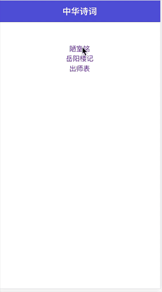

# webapp 动画切换

> 用vue-router实现页面动画切换

## Build Setup

``` bash
# install dependencies
npm install

# serve with hot reload at localhost:8080
npm run dev

# build for production with minification
npm run build

# build for production and view the bundle analyzer report
npm run build --report
```
### 演示效果


#### 实现方式
实现路由和回退动画方式不同，我们可以通过router.go(-1)方式记录回退的状态， 当需要回退的时候调用this.$router.go(-1)

```
  // 在Router的原型上增加一个goBack方法
  Router.prototype.goBack = function () {
    this.isBack = true
    window.history.go(-1)
  }
```
监听路由的变化，根据isBack的值做出不同的动画

```
  beforeRouteUpdate (to, from, next) {
    let isBack = this.$router.isBack
    if (isBack) {
      this.transitionName = 'slide-right'
    } else {
      this.transitionName = 'slider-left'
    }
    //动画结束后将isBack设置为false
    this.$router.isBack = false
    next()
  }
```

#### 设置动画方式
css样式
```
  .child-view {
    position: absolute;
    width:100%;
    transition: all .8s cubic-bezier(.55,0,.1,1);
  }
  .slider-left-enter, .slide-right-leave-active{
    opacity: 0;
    -webkit-transform: translate(100px, 0);
    transform: translate(100px, 0);
  }
  .slide-left-leave-active, .slide-right-enter {
    opacity: 0;
    -webkit-transform: translate(-100px, 0);
    transform: translate(-100px, 0);
  }
```
